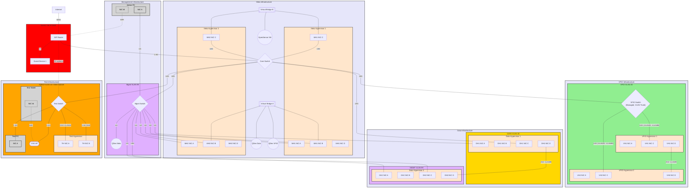
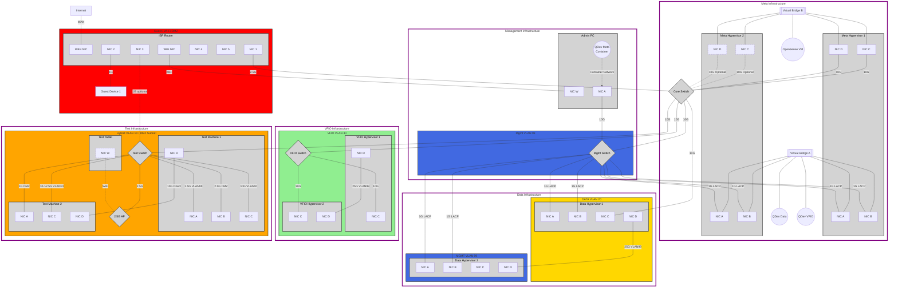
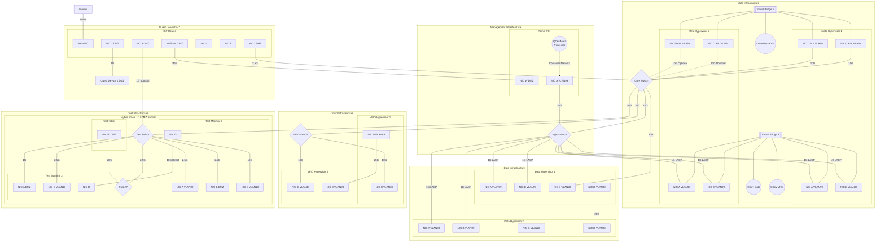
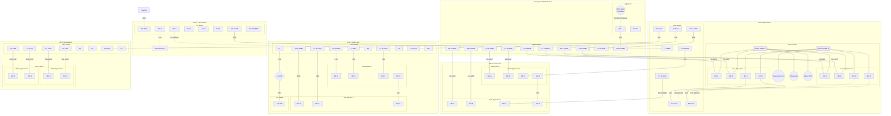
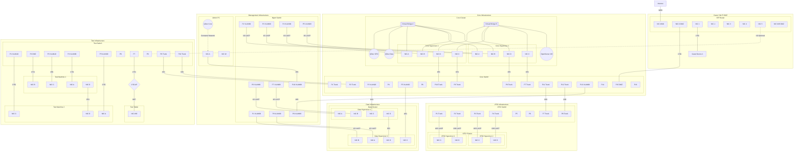
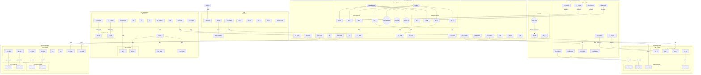
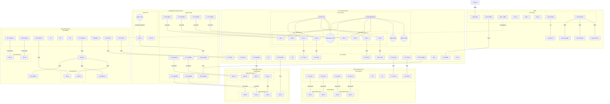

```mermaid
graph TD
    INT[Internet] --- |WAN| ISPR[ISP Router]
    ISPR ---|"2.5G"| CS{Core Switch}
    CS ---|"10G"| MS{Mgmt Switch}
    CS ---|"10G"| VS
    CS ---|"10G"| TS

    subgraph MetaInfrastructure [Meta Infrastructure]
        CS
        subgraph MH1[Meta Hypervisor 1]
            MH1NICA[MH1 NIC A]
            MH1NICB[MH1 NIC B]
            MH1NICC[MH1 NIC C]
            MH1NICD[MH1 NIC D]
        end
        subgraph MH2[Meta Hypervisor 2]
            MH2NICA[MH2 NIC A]
            MH2NICB[MH2 NIC B]
            MH2NICC[MH2 NIC C]
            MH2NICD[MH2 NIC D]
        end
        VBA[[Virtual Bridge A]]
        VBB[[Virtual Bridge B]]
        OPN((OpenSense VM))
        QDD((QDev Data))
        QDV((QDev VFIO))

        VBA --- QDD
        VBA --- QDV
        VBA --- MH1NICB
        VBA --- MH2NICB
        VBB --- OPN
        VBB --- MH1NICC
        VBB --- MH2NICC
    end

    subgraph DataInfrastructure [Data Infrastructure]
        subgraph VLAN20 [DATA VLAN 20]
            subgraph DH1[Data Hypervisor 1]
                DH1NICA[DH1 NIC A]
                DH1NICB[DH1 NIC B]
                DH1NICC[DH1 NIC C]
                DH1NICD[DH1 NIC D]
            end
        end
        subgraph VLAN99Data [MGMT VLAN 99]
            subgraph DH2[Data Hypervisor 2]
                DH2NICA[DH2 NIC A]
                DH2NICB[DH2 NIC B]
                DH2NICC[DH2 NIC C]
                DH2NICD[DH2 NIC D]
            end
        end
    end

    subgraph ManagementInfrastructure [Management Infrastructure]
        subgraph VLAN99 [Mgmt VLAN 99]
            MS
            MH1NICB
            MH2NICB
            QDD
            QDM((QDev Meta))
        end
        subgraph AP[Admin PC]
            APNICA[NIC A]
            APNICW[NIC W]
        end
    end

    MH1NICC ---|"10G"| CS
    MH2NICC ---|"10G"| CS
    MS ---|"1G"| MH1NICA
    MS ---|"1G"| MH1NICB
    MS ---|"1G"| MH2NICA
    MS ---|"1G"| MH2NICB
    MS ---|"1G"| DH1NICA
    MS ---|"1G"| DH2NICA
    MS ---|"10G"| DH2NICC
    APNICA ---|"1G"| MS
    APNICW -.-|"WiFi"| ISPR

    subgraph VFIOInfrastructure [VFIO Infrastructure]
        subgraph VLAN30 [VFIO VLAN 30]
            VS{"VFIO Switch<br>(Managed, VLAN Trunk)"}
            subgraph VH1[VFIO Hypervisor 1]
                VH1NICA[VH1 NIC A]
                VH1NICC[VH1 NIC C]
                VH1NICD[VH1 NIC D]
            end
            subgraph VH2[VFIO Hypervisor 2]
                VH2NICA[VH2 NIC A]
                VH2NICC[VH2 NIC C]
                VH2NICD[VH2 NIC D]
            end
        end
    end

    subgraph TestInfrastructure [Test Infrastructure]
        subgraph HybridNetwork [Hybrid VLAN 10 / DMZ Subnet]
            TS{Test Switch}
            subgraph TH[Test Hypervisor]
                THNICA[TH NIC A]
                THNICB[TH NIC B]
            end
            subgraph TM[Test PC]
                TMNICA[NIC A]
            end
            TAP([2.5G AP])
            subgraph TT[Test Tablet]
                TTNICW[NIC W]
            end
        end
        TS ---|"2.5G VLAN10"| THNICA
        TS ---|"2.5G DMZ"| THNICB
        TS ---|"2.5G"| TMNICA
        TS ---|"2.5G"| TAP
        TTNICW -.-|"WiFi"| TAP
    end

    subgraph Guest [Guest / Wi-Fi DMZ]
        ISPR
        GD[Guest Device 1]
    end

    ISPR ---|"1G"| GD
    MS ---|"1G"| QDM
    TS -.-|"1G optional"| ISPR

    %% Detailed connections
    CS ---|"10G"| DH1NICC
    DH1NICD ---|"25G VLAN99"| DH2NICD
    VS ---|"10G (VLAN30, VLAN99)"| VH1NICC
    VS ---|"10G (VLAN30, VLAN99)"| VH2NICC
    VH1NICD ---|"25G VLAN99"| VH2NICD

    classDef vlan20 fill:#ffd700,stroke:#333,stroke-width:2px;
    class VLAN20 vlan20;
    classDef vlan99 fill:#e0b0ff,stroke:#333,stroke-width:2px;
    class VLAN99,VLAN99Data vlan99;
    classDef vlan30 fill:#90EE90,stroke:#333,stroke-width:2px;
    class VLAN30 vlan30;
    classDef hybridtestnet fill:#ffa500,stroke:#333,stroke-width:2px;
    class HybridNetwork hybridtestnet;
    classDef hypervisor fill:#ffe6cc,stroke:#333,stroke-width:2px;
    class MH1,MH2,DH1,DH2,VH1,VH2,TH hypervisor;
    classDef baremetal fill:#d3d3d3,stroke:#333,stroke-width:2px;
    class AP,TM,TT baremetal;
    classDef baremetalText fill:#d3d3d3,stroke:#333,stroke-width:2px,color:#000;
    class AP,TM,TT,APNICA,APNICW,TMNICA,TTNICW baremetalText;
    classDef optional stroke-dasharray: 5 5;
    class APNICW,TTNICW optional;
    classDef dmz fill:#ff0000,stroke:#333,stroke-width:2px;
    class Guest dmz;
    classDef infrastructure fill:#e6e6fa,stroke:#333,stroke-width:2px;
    class MetaInfrastructure,DataInfrastructure,VFIOInfrastructure,TestInfrastructure,ManagementInfrastructure infrastructure;
```

```mermaid
graph TD
    INT[Internet] --- |WAN| ISPRWAN[ISP Router WAN]
    
    subgraph Guest [Guest / Wi-Fi DMZ]
        subgraph ISPR [ISP Router]
            ISPRWAN[WAN NIC]
            ISPRNIC1[NIC 1]
            ISPRNIC2[NIC 2]
            ISPRNIC3[NIC 3]
            ISPRNIC4[NIC 4]
            ISPRNIC5[NIC 5]
            ISPRWIFI[WiFi NIC]
        end
        GD[Guest Device 1]
    end
    
    ISPRNIC1 ---|"2.5G"| CS{Core Switch}
    ISPRNIC2 ---|"1G"| GD
    ISPRNIC3 -.-|"1G optional"| TS
    ISPRWIFI ---|"WiFi"| APNICW
    CS ---|"10G"| MS{Mgmt Switch}
    CS ---|"10G"| VS{VFIO Switch}
    CS ---|"10G"| TS{Test Switch}
    
    subgraph MetaInfrastructure [Meta Infrastructure]
        CS
        subgraph MH1[Meta Hypervisor 1]
            MH1NICA[NIC A]
            MH1NICB[NIC B]
            MH1NICC[NIC C]
            MH1NICD[NIC D]
        end
        subgraph MH2[Meta Hypervisor 2]
            MH2NICA[NIC A]
            MH2NICB[NIC B]
            MH2NICC[NIC C]
            MH2NICD[NIC D]
        end
        VBA[[Virtual Bridge A]]
        VBB[[Virtual Bridge B]]
        OPN((OpenSense VM))
        QDD((QDev Data))
        QDV((QDev VFIO))
        
        VBA --- MH1NICB
        VBA --- MH2NICB
        VBA --- MH1NICA
        VBA --- MH2NICA
        VBA --- QDD
        VBA --- QDV
        VBB --- OPN
        VBB --- MH1NICC
        VBB --- MH2NICC
        VBB --- MH1NICD
        VBB --- MH2NICD
    end
    
    subgraph DataInfrastructure [Data Infrastructure]
        subgraph VLAN20 [DATA VLAN 20]
            subgraph DH1[Data Hypervisor 1]
                DH1NICA[NIC A]
                DH1NICB[NIC B]
                DH1NICC[NIC C]
                DH1NICD[NIC D]
            end
        end
        subgraph VLAN99Data [MGMT VLAN 99]
            subgraph DH2[Data Hypervisor 2]
                DH2NICA[NIC A]
                DH2NICB[NIC B]
                DH2NICC[NIC C]
                DH2NICD[NIC D]
            end
        end
    end
    
    subgraph ManagementInfrastructure [Management Infrastructure]
        subgraph VLAN99 [Mgmt VLAN 99]
            MS
            MH1NICB
            MH2NICB
        end
        subgraph AP[Admin PC]
            APNICA[NIC A]
            APNICW[NIC W]
            QDM((QDev Meta<br>Container))
        end
    end
    
    MH1NICC ---|"10G"| CS
    MH1NICD ---|"10G"| CS
    MH2NICC -.-|"10G Optional"| CS
    MH2NICD -.-|"10G Optional"| CS
    MS ---|"1G LACP"| MH1NICA
    MS ---|"1G LACP"| MH1NICB
    MS ---|"1G LACP"| MH2NICA
    MS ---|"1G LACP"| MH2NICB
    MS ---|"1G LACP"| DH1NICA
    MS ---|"1G LACP"| DH1NICB
    MS ---|"1G LACP"| DH2NICA
    MS ---|"1G LACP"| DH2NICB
    APNICA ---|"10G"| MS
    QDM -.->|"Container Network"| APNICA

    subgraph VFIOInfrastructure [VFIO Infrastructure]
        subgraph VLAN30 [VFIO VLAN 30]
            VS
            subgraph VH1[VFIO Hypervisor 1]
                VH1NICC[NIC C]
                VH1NICD[NIC D]
            end
            subgraph VH2[VFIO Hypervisor 2]
                VH2NICC[NIC C]
                VH2NICD[NIC D]
            end
        end
    end
    
    subgraph TestInfrastructure [Test Infrastructure]
        subgraph HybridNetwork [Hybrid VLAN 10 / DMZ Subnet]
            TS
            subgraph TM1[Test Machine 1]
                THNICA[NIC A]
                THNICB[NIC B]
                THNICC[NIC C]
                THNICD[NIC D]
            end
            subgraph TM2[Test Machine 2]
                TMNICA[NIC A]
                TMNICC[NIC C]
                TMNICD[NIC D]
            end
            TAP{2.5G AP}
            subgraph TT[Test Tablet]
                TTNICW[NIC W]
            end
        end
        TS ---|"2.5G VLAN99"| THNICA
        TS ---|"2.5G DMZ"| THNICB
        TS ---|"10G VLAN10"| THNICC
        TS ---|"1G DMZ"| TMNICA
        TS ---|"10->2.5G VLAN10"| TMNICC
        THNICD ---|"10G Direct"| TMNICD
        TS ---|"2.5G"| TAP
        TTNICW -.-|"WiFi"| TAP
    end

    %% Detailed connections
    CS ---|"10G"| DH1NICC
    DH1NICD ---|"25G VLAN99"| DH2NICD
    VS ---|"10G"| VH1NICC
    VS ---|"10G"| VH2NICC
    VH1NICD ---|"25G VLAN99"| VH2NICD
    
    classDef vlan20 fill:#ffd700,stroke:#333,stroke-width:2px;
    class VLAN20 vlan20;
    classDef vlan99 fill:#4169E1,stroke:#333,stroke-width:2px;
    class VLAN99,VLAN99Data vlan99;
    classDef vlan30 fill:#90EE90,stroke:#333,stroke-width:2px;
    class VLAN30 vlan30;
    classDef hybridtestnet fill:#ffa500,stroke:#333,stroke-width:2px;
    class HybridNetwork hybridtestnet;
    classDef devices fill:#d3d3d3,stroke:#333,stroke-width:2px,color:#000;
    class MH1,MH2,DH1,DH2,VH1,VH2,TM1,AP,TM2,TT,ISPR,CS,MS,VS,TS,TAP devices;
    classDef optional stroke-dasharray: 5 5;
    class TTNICW,MH2NICC,MH2NICD optional;
    classDef dmz fill:#ff0000,stroke:#333,stroke-width:2px;
    class Guest dmz;
    classDef infrastructure fill:none,stroke:#800080,stroke-width:4px;
    class MetaInfrastructure,DataInfrastructure,VFIOInfrastructure,TestInfrastructure,ManagementInfrastructure infrastructure;
```

```mermaid
graph TD
    INT[Internet] --- |WAN| ISPRWAN[ISP Router WAN]

    subgraph GuestZone [Guest / Wi-Fi DMZ]
        subgraph ISPR [ISP Router]
            ISPRWAN[WAN NIC]
            ISPRNIC1[NIC 1 DMZ]
            ISPRNIC2[NIC 2 DMZ]
            ISPRNIC3[NIC 3 DMZ]
            ISPRNIC4[NIC 4]
            ISPRNIC5[NIC 5]
            ISPRWIFI[WiFi NIC DMZ]
        end
        GD[Guest Device 1 DMZ]
    end

    ISPRNIC1 ---|"2.5G"| CS{Core Switch}
    ISPRNIC2 ---|"1G"| GD
    ISPRNIC3 -.-|"1G optional"| TS
    ISPRWIFI ---|"WiFi"| APNICW
    CS ---|"10G"| MS{Mgmt Switch}
    CS ---|"10G"| VS{VFIO Switch}
    CS ---|"10G"| TS{Test Switch}

    subgraph MetaInfrastructure [Meta Infrastructure]
        CS
        subgraph MH1[Meta Hypervisor 1]
            MH1NICA[NIC A VLAN99]
            MH1NICB[NIC B VLAN99]
            MH1NICC[NIC C ALL VLANs]
            MH1NICD[NIC D ALL VLANs]
        end
        subgraph MH2[Meta Hypervisor 2]
            MH2NICA[NIC A VLAN99]
            MH2NICB[NIC B VLAN99]
            MH2NICC[NIC C ALL VLANs]
            MH2NICD[NIC D ALL VLANs]
        end
        VBA[[Virtual Bridge A]]
        VBB[[Virtual Bridge B]]
        OPN((OpenSense VM))
        QDD((QDev Data))
        QDV((QDev VFIO))

        VBA --- MH1NICB
        VBA --- MH2NICB
        VBA --- MH1NICA
        VBA --- MH2NICA
        VBA --- QDD
        VBA --- QDV
        VBB --- OPN
        VBB --- MH1NICC
        VBB --- MH2NICC
        VBB --- MH1NICD
        VBB --- MH2NICD
    end

    subgraph DataInfrastructure [Data Infrastructure]
        subgraph DH1[Data Hypervisor 1]
            DH1NICA[NIC A VLAN99]
            DH1NICB[NIC B VLAN99]
            DH1NICC[NIC C VLAN20]
            DH1NICD[NIC D VLAN99]
        end
        subgraph DH2[Data Hypervisor 2]
            DH2NICA[NIC A VLAN99]
            DH2NICB[NIC B VLAN99]
            DH2NICC[NIC C VLAN20]
            DH2NICD[NIC D VLAN99]
        end
    end

    subgraph ManagementInfrastructure [Management Infrastructure]
        MS
        MH1NICB
        MH2NICB
        subgraph AP[Admin PC]
            APNICA[NIC A VLAN99]
            APNICW[NIC W DMZ]
            QDM((QDev Meta<br>Container))
        end
    end

    MH1NICC ---|"10G"| CS
    MH1NICD ---|"10G"| CS
    MH2NICC -.-|"10G Optional"| CS
    MH2NICD -.-|"10G Optional"| CS
    MS ---|"1G LACP"| MH1NICA
    MS ---|"1G LACP"| MH1NICB
    MS ---|"1G LACP"| MH2NICA
    MS ---|"1G LACP"| MH2NICB
    MS ---|"1G LACP"| DH1NICA
    MS ---|"1G LACP"| DH1NICB
    MS ---|"1G LACP"| DH2NICA
    MS ---|"1G LACP"| DH2NICB
    APNICA ---|"10G"| MS
    QDM -.->|"Container Network"| APNICA

    subgraph VFIOInfrastructure [VFIO Infrastructure]
        VS
        subgraph VH1[VFIO Hypervisor 1]
            VH1NICC[NIC C VLAN30]
            VH1NICD[NIC D VLAN99]
        end
        subgraph VH2[VFIO Hypervisor 2]
            VH2NICC[NIC C VLAN30]
            VH2NICD[NIC D VLAN99]
        end
    end

    subgraph TestInfrastructure [Test Infrastructure]
        subgraph HybridNetwork [Hybrid VLAN 10 / DMZ Subnet]
            TS
            subgraph TM1[Test Machine 1]
                THNICA[NIC A VLAN99]
                THNICB[NIC B DMZ]
                THNICC[NIC C VLAN10]
                THNICD[NIC D]
            end
            subgraph TM2[Test Machine 2]
                TMNICA[NIC A DMZ]
                TMNICC[NIC C VLAN10]
                TMNICD[NIC D]
            end
            TAP{2.5G AP}
            subgraph TT[Test Tablet]
                TTNICW[NIC W DMZ]
            end
        end
        TS ---|"2.5G"| THNICA
        TS ---|"2.5G"| THNICB
        TS ---|"10G"| THNICC
        TS ---|"1G"| TMNICA
        TS ---|"2.5G"| TMNICC
        THNICD ---|"10G Direct"| TMNICD
        TS ---|"2.5G"| TAP
        TTNICW -.-|"WiFi"| TAP
    end

    %% Detailed connections
    CS ---|"10G"| DH1NICC
    DH1NICD ---|"25G"| DH2NICD
    VS ---|"10G"| VH1NICC
    VS ---|"10G"| VH2NICC
    VH1NICD ---|"25G"| VH2NICD
```

```mermaid
graph TD
    INT[Internet] --- |WAN| ISPRWAN[ISP Router WAN]

    subgraph GuestZone [Guest / Wi-Fi DMZ]
        subgraph ISPR [ISP Router]
            ISPRWAN[WAN NIC]
            ISPRNIC1[NIC 1 DMZ]
            ISPRNIC2[NIC 2 DMZ]
            ISPRNIC3[NIC 3 DMZ]
            ISPRNIC4[NIC 4]
            ISPRNIC5[NIC 5]
            ISPRWIFI[WiFi NIC DMZ]
        end
        GD[Guest Device 1 DMZ]
    end

    ISPRNIC1 ---|"2.5G"| CS{Core Switch}
    ISPRNIC2 ---|"1G"| GD
    ISPRNIC3 -.-|"1G optional"| TS
    ISPRWIFI ---|"WiFi"| APNICW
    CS ---|"10G"| MS{Mgmt Switch}
    CS ---|"10G"| VS{VFIO Switch}
    CS ---|"10G"| TS{Test Switch}

    subgraph MetaInfrastructure [Meta Infrastructure]
        CS
        subgraph MH1[Meta Hypervisor 1]
            MH1NICA[NIC A VLAN99]
            MH1NICB[NIC B VLAN99]
            MH1NICC[NIC C ALL VLANs]
            MH1NICD[NIC D ALL VLANs]
        end
        subgraph MH2[Meta Hypervisor 2]
            MH2NICA[NIC A VLAN99]
            MH2NICB[NIC B VLAN99]
            MH2NICC[NIC C ALL VLANs]
            MH2NICD[NIC D ALL VLANs]
        end
        VBA[[Virtual Bridge A]]
        VBB[[Virtual Bridge B]]
        OPN((OpenSense VM))
        QDD((QDev Data))
        QDV((QDev VFIO))

        VBA --- MH1NICB
        VBA --- MH2NICB
        VBA --- MH1NICA
        VBA --- MH2NICA
        VBA --- QDD
        VBA --- QDV
        VBB --- OPN
        VBB --- MH1NICC
        VBB --- MH2NICC
        VBB --- MH1NICD
        VBB --- MH2NICD
    end

    subgraph DataInfrastructure [Data Infrastructure]
        subgraph DH1[Data Hypervisor 1]
            DH1NICA[NIC A VLAN99]
            DH1NICB[NIC B VLAN99]
            DH1NICC[NIC C VLAN20]
            DH1NICD[NIC D VLAN99]
        end
        subgraph DH2[Data Hypervisor 2]
            DH2NICA[NIC A VLAN99]
            DH2NICB[NIC B VLAN99]
            DH2NICC[NIC C VLAN20]
            DH2NICD[NIC D VLAN99]
        end
    end

    subgraph ManagementInfrastructure [Management Infrastructure]
        MS
        MH1NICB
        MH2NICB
        subgraph AP[Admin PC]
            APNICA[NIC A VLAN99]
            APNICW[NIC W DMZ]
            QDM((QDev Meta<br>Container))
        end
    end

    MH1NICC ---|"10G"| CS
    MH1NICD ---|"10G"| CS
    MH2NICC -.-|"10G Optional"| CS
    MH2NICD -.-|"10G Optional"| CS
    MS ---|"1G LACP"| MH1NICA
    MS ---|"1G LACP"| MH1NICB
    MS ---|"1G LACP"| MH2NICA
    MS ---|"1G LACP"| MH2NICB
    MS ---|"1G LACP"| DH1NICA
    MS ---|"1G LACP"| DH1NICB
    MS ---|"1G LACP"| DH2NICA
    MS ---|"1G LACP"| DH2NICB
    APNICA ---|"10G"| MS
    QDM -.->|"Container Network"| APNICA

    subgraph VFIOInfrastructure [VFIO Infrastructure]
        VS
        subgraph VH1[VFIO Hypervisor 1]
            VH1NICC[NIC C VLAN30]
            VH1NICD[NIC D VLAN99]
        end
        subgraph VH2[VFIO Hypervisor 2]
            VH2NICC[NIC C VLAN30]
            VH2NICD[NIC D VLAN99]
        end
    end

    subgraph TestInfrastructure [Test Infrastructure]
        subgraph HybridNetwork [Hybrid VLAN 10 / DMZ Subnet]
            TS
            subgraph TM1[Test Machine 1]
                THNICA[NIC A VLAN99]
                THNICB[NIC B DMZ]
                THNICC[NIC C VLAN10]
                THNICD[NIC D]
            end
            subgraph TM2[Test Machine 2]
                TMNICA[NIC A DMZ]
                TMNICC[NIC C VLAN10]
                TMNICD[NIC D]
            end
            TAP{2.5G AP}
            subgraph TT[Test Tablet]
                TTNICW[NIC W DMZ]
            end
        end
        TS ---|"2.5G"| THNICA
        TS ---|"2.5G"| THNICB
        TS ---|"10G"| THNICC
        TS ---|"1G"| TMNICA
        TS ---|"2.5G"| TMNICC
        THNICD ---|"10G Direct"| TMNICD
        TS ---|"2.5G"| TAP
        TTNICW -.-|"WiFi"| TAP
    end

    %% Detailed connections
    CS ---|"10G"| DH1NICC
    DH1NICD ---|"25G"| DH2NICD
    VS ---|"10G"| VH1NICC
    VS ---|"10G"| VH2NICC
    VH1NICD ---|"25G"| VH2NICD
```

```mermaid
graph TD
    INT[Internet] --- |WAN| ISPRWAN[NIC WAN]

    subgraph GuestZone [Guest / Wi-Fi DMZ]
        subgraph ISPR [ISP Router]
            ISPRWAN[NIC WAN]
            ISPRNIC0[NIC 0 DMZ]
            ISPRNIC1[NIC 1]
            ISPRNIC2[NIC 2]
            ISPRNIC3[NIC 3]
            ISPRNIC4[NIC 4]
            ISPRNIC5[NIC 5]
            ISPRWIFI[NIC Wifi DMZ]
        end
        GD[Guest Device 1]
    end

    subgraph CoreInfrastructure [Core Infrastructure]
        subgraph CS [Core Switch]
            CSP1[P1 DMZ]
            CSP2[P2 VLAN99]
            CSP3[P3 Trunk]
            CSP4[P4 Trunk]
            CSP5[P5 VLAN20]
            CSP6[P6 VLAN20]
            CSP7[P7 Trunk]
            CSP8[P8 Trunk]
        end
        subgraph CoreCluster [Core Cluster]
            subgraph CH1[Core Hypervisor 1]
                CH1NICA[NIC A]
                CH1NICB[NIC B]
                CH1NICC[NIC C]
                CH1NICD[NIC D]
            end
            subgraph CH2[Core Hypervisor 2]
                CH2NICA[NIC A]
                CH2NICB[NIC B]
                CH2NICC[NIC C]
                CH2NICD[NIC D]
            end
            VBA[[Virtual Bridge A]]
            VBB[[Virtual Bridge B]]
            OPN((OpenSense VM))
            QDD((QDev Data))
            QDV((QDev VFIO))
        end
    end

    subgraph ManagementInfrastructure [Management Infrastructure]
        subgraph MS [Mgmt Switch]
            MSP1[P1 VLAN99]
            MSP2[P2 VLAN99]
            MSP3[P3 VLAN99]
            MSP4[P4 VLAN99]
            MSP5[P5 VLAN99]
            MSP6[P6 VLAN99]
            MSP7[P7 VLAN99]
            MSP8[P8 VLAN99]
            MSP9[P9 VLAN99]
            MSP10[P10 VLAN99]
        end
        subgraph AP[Admin PC]
            APNICA[NIC A]
            APNICW[NIC W]
            QDM((QDev Meta<br>Container))
        end
    end

    subgraph DataInfrastructure [Data Infrastructure]
        subgraph DataCluster [Data Cluster]
            subgraph DH1[Data Hypervisor 1]
                DH1NICA[NIC A]
                DH1NICB[NIC B]
                DH1NICC[NIC C]
                DH1NICD[NIC D]
            end
            subgraph DH2[Data Hypervisor 2]
                DH2NICA[NIC A]
                DH2NICB[NIC B]
                DH2NICC[NIC C]
                DH2NICD[NIC D]
            end
        end
    end

    subgraph TestInfrastructure [Test Infrastructure]
        subgraph TS [Test Switch]
            TSP1[P1 VLAN10]
            TSP2[P2 DMZ]
            TSP3[P3 VLAN10]
            TSP4[P4 VLAN99]
            TSP5[P5 VLAN99]
            TSP6[P6]
            TSP7[P7]
            TSP8[P8]
            TSP9[P9 Trunk]
            TSP10[P10]
        end
        subgraph TM1[Test Machine 1]
            THNICA[NIC A]
            THNICB[NIC B]
            THNICC[NIC C]
            THNICD[NIC D]
        end
        subgraph TM2[Test Machine 2]
            TMNICA[NIC A]
            TMNICC[NIC C]
            TMNICD[NIC D]
        end
        TAP{2.5G AP}
        subgraph TT[Test Tablet]
            TTNICW[NIC Wifi]
        end
    end

    subgraph VFIOInfrastructure [VFIO Infrastructure]
        subgraph VS [VFIO Switch]
            VSP1[P1 Trunk]
            VSP2[P2 Trunk]
            VSP3[P3 Trunk]
            VSP4[P4 Trunk]
            VSP5[P5]
            VSP6[P6]
            VSP7[P7 Trunk]
            VSP8[P8]
        end
        subgraph VFIOCluster [VFIO Cluster]
            subgraph VH1[VFIO Hypervisor 1]
                VH1NICC[NIC C]
                VH1NICD[NIC D]
            end
            subgraph VH2[VFIO Hypervisor 2]
                VH2NICC[NIC C]
                VH2NICD[NIC D]
            end
        end
    end

    %% Connections (unchanged)
    ISPRNIC0 ---|"2.5G"| CSP1
    CSP2 ---|"10G"| MSP9
    CSP3 ---|"10G"| VSP7
    CSP4 ---|"10G"| TSP9
    CH1NICC ---|"10G"| CSP7
    CH1NICD ---|"10G"| CSP8
    CH2NICC -.-|"10G Optional"| CSP7
    CH2NICD -.-|"10G Optional"| CSP8
    MSP2 ---|"1G LACP"| CH1NICA
    MSP3 ---|"1G LACP"| CH1NICB
    MSP4 ---|"1G LACP"| CH2NICA
    MSP5 ---|"1G LACP"| CH2NICB
    MSP6 ---|"1G LACP"| DH1NICA
    MSP7 ---|"1G LACP"| DH1NICB
    MSP8 ---|"1G LACP"| DH2NICA
    MSP1 ---|"1G LACP"| DH2NICB
    APNICA ---|"10G"| MSP10
    QDM -.->|"Container Network"| APNICA
    CSP5 ---|"10G"| DH1NICC
    CSP6 ---|"10G VLAN20"| DH2NICC
    DH1NICD ---|"25G"| DH2NICD
    VSP1 ---|"10G LACP"| VH1NICC
    VSP2 ---|"10G LACP"| VH1NICD
    VSP3 ---|"10G LACP"| VH2NICC
    VSP4 ---|"10G LACP"| VH2NICD
    TSP4 ---|"2.5G"| THNICA
    TSP2 ---|"2.5G"| THNICB
    TSP3 ---|"10G"| THNICC
    TSP5 ---|"2.5G"| TMNICA
    TSP1 ---|"2.5G"| TMNICC
    TSP7 ---|"2.5G"| TAP
    TAP ---|"WiFi"| TTNICW
    THNICD ---|"25G"| TMNICD
    ISPRNIC1 ---|"2.5G"| GD
    ISPRNIC5 -.-|"1G Optional"| TSP8

    %% Virtual Bridge Connections
    VBA --- CH1NICB
    VBA --- CH2NICB
    VBA --- CH1NICA
    VBA --- CH2NICA
    VBA --- QDD
    VBA --- QDV
    VBB --- OPN
    VBB --- CH1NICC
    VBB --- CH2NICC
    VBB --- CH1NICD
    VBB --- CH2NICD
```

```mermaid
graph TD
    INT[Internet] --- |WAN| ISPRWAN[NIC WAN]

    subgraph GuestZone [Guest / Wi-Fi DMZ]
        subgraph ISPR [ISP Router]
            ISPRWAN[NIC WAN]
            ISPRNIC0[NIC 0 DMZ]
            ISPRNIC1[NIC 1]
            ISPRNIC2[NIC 2]
            ISPRNIC3[NIC 3]
            ISPRNIC4[NIC 4]
            ISPRNIC5[NIC 5]
            ISPRWIFI[NIC Wifi DMZ]
        end
        GD[Guest Device 1]
    end

    subgraph CoreInfrastructure [Core Infrastructure]
        subgraph CS [Core Switch]
            CSP1[P1 Trunk]
            CSP2[P2 Trunk]
            CSP3[P3 VLAN20]
            CSP4[P4]
            CSP5[P5 VLAN20]
            CSP6[P6]
            CSP7[P7 Trunk]
            CSP8[P8 Trunk]
            CSP9[P9 Trunk]
            CSP10[P10 Trunk]
            CSP11[P11 Trunk]
            CSP12[P12 Trunk]
            CSP13[P13 VLAN99]
            CSP14[P14]
            CSP15[P15 DMZ]
            CSP16[P16]
        end
        subgraph CoreCluster [Core Cluster]
            subgraph CH1[Core Hypervisor 1]
                CH1NICA[NIC A]
                CH1NICB[NIC B]
                CH1NICC[NIC C]
                CH1NICD[NIC D]
            end
            subgraph CH2[Core Hypervisor 2]
                CH2NICA[NIC A]
                CH2NICB[NIC B]
                CH2NICC[NIC C]
                CH2NICD[NIC D]
            end
            VBA[[Virtual Bridge A]]
            VBB[[Virtual Bridge B]]
            OPN((OpenSense VM))
            QDD((QDev Data))
            QDV((QDev VFIO))
        end
    end

    subgraph ManagementInfrastructure [Management Infrastructure]
        subgraph MS [Mgmt Switch]
            MSP1[P1 VLAN99]
            MSP2[P2 VLAN99]
            MSP3[P3 VLAN99]
            MSP4[P4 VLAN99]
            MSP5[P5 VLAN99]
            MSP6[P6 VLAN99]
            MSP7[P7 VLAN99]
            MSP8[P8 VLAN99]
            MSP9[P9 VLAN99]
            MSP10[P10 VLAN99]
        end
        subgraph AP[Admin PC]
            APNICA[NIC A]
            APNICW[NIC W]
            QDC((QDev Core))
        end
    end

    subgraph DataInfrastructure [Data Infrastructure]
        subgraph DataCluster [Data Cluster]
            subgraph DH1[Data Hypervisor 1]
                DH1NICA[NIC A]
                DH1NICB[NIC B]
                DH1NICC[NIC C]
                DH1NICD[NIC D]
            end
            subgraph DH2[Data Hypervisor 2]
                DH2NICA[NIC A]
                DH2NICB[NIC B]
                DH2NICC[NIC C]
                DH2NICD[NIC D]
            end
        end
    end

    subgraph TestInfrastructure [Test Infrastructure]
        subgraph TS [Test Switch]
            TSP1[P1 VLAN10]
            TSP2[P2 DMZ]
            TSP3[P3 VLAN10]
            TSP4[P4 VLAN99]
            TSP5[P5 VLAN99]
            TSP6[P6]
            TSP7[P7]
            TSP8[P8]
            TSP9[P9 Trunk]
            TSP10[P10 Trunk]
        end
        subgraph TM1[Test Machine 1]
            THNICA[NIC A]
            THNICB[NIC B]
            THNICC[NIC C]
            THNICD[NIC D]
        end
        subgraph TM2[Test Machine 2]
            TMNICA[NIC A]
            TMNICC[NIC C]
            TMNICD[NIC D]
        end
        TAP{2.5G AP}
        subgraph TT[Test Tablet]
            TTNICW[NIC Wifi]
        end
    end

    subgraph VFIOInfrastructure [VFIO Infrastructure]
        subgraph VS [VFIO Switch]
            VSP1[P1 Trunk]
            VSP2[P2 Trunk]
            VSP3[P3 Trunk]
            VSP4[P4 Trunk]
            VSP5[P5]
            VSP6[P6]
            VSP7[P7 Trunk]
            VSP8[P8 Trunk]
        end
        subgraph VFIOCluster [VFIO Cluster]
            subgraph VH1[VFIO Hypervisor 1]
                VH1NICC[NIC C]
                VH1NICD[NIC D]
            end
            subgraph VH2[VFIO Hypervisor 2]
                VH2NICC[NIC C]
                VH2NICD[NIC D]
            end
        end
    end

    %% Connections
    ISPRNIC0 ---|"2.5G"| CSP15
    CSP13 ---|"10G"| MSP9
    CSP11 ---|"10G"| VSP7
    CSP12 ---|"10G"| VSP8
    CSP3 ---|"10G"| DH1NICC
    CSP5 ---|"10G"| DH2NICC
    CH1NICC ---|"10G"| CSP7
    CH1NICD ---|"10G"| CSP9
    CH2NICC ---|"10G"| CSP8
    CH2NICD ---|"10G"| CSP10
    TSP9 ---|"10G"| CSP1
    TSP10 ---|"10G"| CSP2
    MSP2 ---|"1G LACP"| CH1NICA
    MSP3 ---|"1G LACP"| CH1NICB
    MSP4 ---|"1G LACP"| CH2NICA
    MSP5 ---|"1G LACP"| CH2NICB
    MSP6 ---|"1G LACP"| DH1NICA
    MSP7 ---|"1G LACP"| DH1NICB
    MSP8 ---|"1G LACP"| DH2NICA
    MSP1 ---|"1G LACP"| DH2NICB
    APNICA ---|"10G"| MSP10
    QDC -.->|"Container Network"| APNICA
    DH1NICD ---|"25G"| DH2NICD
    VSP1 ---|"10G LACP"| VH1NICC
    VSP2 ---|"10G LACP"| VH1NICD
    VSP3 ---|"10G LACP"| VH2NICC
    VSP4 ---|"10G LACP"| VH2NICD
    TSP4 ---|"2.5G"| THNICA
    TSP2 ---|"2.5G"| THNICB
    TSP3 ---|"10G"| THNICC
    TSP5 ---|"2.5G"| TMNICA
    TSP1 ---|"2.5G"| TMNICC
    TSP7 ---|"2.5G"| TAP
    TAP ---|"WiFi"| TTNICW
    THNICD ---|"25G"| TMNICD
    ISPRNIC1 ---|"2.5G"| GD
    ISPRNIC5 -.-|"1G Optional"| TSP8

    %% Virtual Bridge Connections
    VBA --- CH1NICB
    VBA --- CH2NICB
    VBA --- CH1NICA
    VBA --- CH2NICA
    VBA --- QDD
    VBA --- QDV
    VBB --- OPN
    VBB --- CH1NICC
    VBB --- CH2NICC
    VBB --- CH1NICD
    VBB --- CH2NICD
```

```mermaid
graph TD
    INT[Internet] --- |WAN| ISPRWAN[NIC WAN]

    subgraph DMZ [DMZ]
        subgraph ISPR [ISP Router]
            ISPRWAN[NIC WAN]
            ISPRNIC0[NIC 0 DMZ]
            ISPRNIC1[NIC 1]
            ISPRNIC2[NIC 2]
            ISPRNIC3[NIC 3]
            ISPRNIC4[NIC 4]
            ISPRNIC5[NIC 5]
            ISPRWIFI[NIC Wifi DMZ]
        end
        GD[Guest Device 1]
    end

    subgraph CoreInfrastructure [Core Infrastructure]
        subgraph CS [Core Switch]
            CSP1[P1 Trunk]
            CSP2[P2 Trunk]
            CSP3[P3 VLAN20]
            CSP4[P4]
            CSP5[P5 VLAN20]
            CSP6[P6]
            CSP7[P7 Trunk]
            CSP8[P8 Trunk]
            CSP9[P9 Trunk]
            CSP10[P10 Trunk]
            CSP11[P11 Trunk]
            CSP12[P12 Trunk]
            CSP13[P13 VLAN99]
            CSP14[P14]
            CSP15[P15 DMZ]
            CSP16[P16]
        end
        subgraph CoreCluster [Core Cluster]
            subgraph CH1[Core Hypervisor 1]
                CH1NICA[NIC A]
                CH1NICB[NIC B]
                CH1NICC[NIC C]
                CH1NICD[NIC D]
            end
            subgraph CH2[Core Hypervisor 2]
                CH2NICA[NIC A]
                CH2NICB[NIC B]
                CH2NICC[NIC C]
                CH2NICD[NIC D]
            end
            PCIEPT[[PCI-E PT]]
            VBB[[Virtual Bridge B]]
            OPN((OpenSense VM))
            QDD((QDev Data))
            QDV((QDev VFIO))
        end
    end

    subgraph ManagementInfrastructure [Management Infrastructure]
        subgraph MS [Mgmt Switch]
            MSP1[P1 VLAN99]
            MSP2[P2 VLAN99]
            MSP3[P3 VLAN99]
            MSP4[P4 VLAN99]
            MSP5[P5 VLAN99]
            MSP6[P6 VLAN99]
            MSP7[P7 VLAN99]
            MSP8[P8 VLAN99]
            MSP9[P9 VLAN99]
            MSP10[P10 VLAN99]
        end
        subgraph AP[Admin PC]
            APNICA[NIC A]
            APNICW[NIC W]
            QDC((QDev Core))
        end
    end

    subgraph DataInfrastructure [Data Infrastructure]
        subgraph DataCluster [Data Cluster]
            subgraph DH1[Data Hypervisor 1]
                DH1NICA[NIC A]
                DH1NICB[NIC B]
                DH1NICC[NIC C]
                DH1NICD[NIC D]
            end
            subgraph DH2[Data Hypervisor 2]
                DH2NICA[NIC A]
                DH2NICB[NIC B]
                DH2NICC[NIC C]
                DH2NICD[NIC D]
            end
        end
    end

    subgraph TestInfrastructure [Test Infrastructure]
        subgraph TS [Test Switch]
            TSP1[P1 VLAN10]
            TSP2[P2 VLAN10]
            TSP3[P3 VLAN10]
            TSP4[P4]
            TSP5[P5]
            TSP6[P6]
            TSP7[P7 VLAN10]
            TSP8[P8]
            TSP9[P9 Trunk]
            TSP10[P10 Trunk]
        end
        subgraph TM1[Test Machine 1]
            TM1NICA[NIC A]
            TM1NICB[NIC B]
        end
        subgraph TM2[Test Machine 2]
            TM2NICA[NIC A]
            TM2NICW[NIC W]
        end
        TAP[Test AP]
        TT[Test Tablet]
        TP[Test Phone]
    end

    subgraph VFIOInfrastructure [VFIO Infrastructure]
        subgraph VS [VFIO Switch]
            VSP1[P1 Trunk]
            VSP2[P2 Trunk]
            VSP3[P3 Trunk]
            VSP4[P4 Trunk]
            VSP5[P5]
            VSP6[P6]
            VSP7[P7 Trunk]
            VSP8[P8 Trunk]
        end
        subgraph VFIOCluster [VFIO Cluster]
            subgraph VH1[VFIO Hypervisor 1]
                VH1NICC[NIC C]
                VH1NICD[NIC D]
            end
            subgraph VH2[VFIO Hypervisor 2]
                VH2NICC[NIC C]
                VH2NICD[NIC D]
            end
        end
    end

    %% Connections
    ISPRNIC0 ---|"2.5G"| CSP15
    CSP13 ---|"10G"| MSP9
    CSP11 ---|"10G"| VSP7
    CSP12 ---|"10G"| VSP8
    CSP3 ---|"10G"| DH1NICC
    CSP5 ---|"10G"| DH2NICC
    CH1NICC ---|"10G"| CSP7
    CH1NICD ---|"10G"| CSP9
    CH2NICC ---|"10G"| CSP8
    CH2NICD ---|"10G"| CSP10
    TSP9 ---|"10G"| CSP1
    TSP10 ---|"10G"| CSP2
    MSP2 ---|"1G LACP"| CH1NICA
    MSP3 ---|"1G LACP"| CH1NICB
    MSP4 ---|"1G LACP"| CH2NICA
    MSP5 ---|"1G LACP"| CH2NICB
    MSP6 ---|"1G LACP"| DH1NICA
    MSP7 ---|"1G LACP"| DH1NICB
    MSP8 ---|"1G LACP"| DH2NICA
    MSP1 ---|"1G LACP"| DH2NICB
    APNICA ---|"10G"| MSP10
    QDC -.->|"Container Network"| APNICA
    DH1NICD ---|"25G"| DH2NICD
    VSP1 ---|"10G LACP"| VH1NICC
    VSP2 ---|"10G LACP"| VH1NICD
    VSP3 ---|"10G LACP"| VH2NICC
    VSP4 ---|"10G LACP"| VH2NICD
    TSP1 ---|"2.5G LACP"| TM1NICA
    TSP2 ---|"2.5G LACP"| TM1NICB
    TSP3 ---|"2.5G"| TM2NICA
    TSP7 ---|"2.5G"| TAP
    TAP ---|"WiFi"| TT
    TAP ---|"WiFi"| TP
    TAP ---|"WiFi"| TM2NICW
    ISPRNIC1 ---|"2.5G"| GD

    %% PCI-E PT and Virtual Bridge Connections
    PCIEPT --- CH1NICC
    PCIEPT --- CH1NICD
    PCIEPT --- CH2NICC
    PCIEPT --- CH2NICD
    PCIEPT --- OPN
    VBB --- CH1NICA
    VBB --- CH1NICB
    VBB --- CH2NICA
    VBB --- CH2NICB
    VBB --- QDD
    VBB --- QDV
```

```mermaid
graph TD
    INT[Internet] --- |WAN| ISPRWAN[NIC WAN]

    subgraph DMZ [DMZ]
        subgraph ISPR [ISP Router]
            ISPRWAN[NIC WAN]
            ISPRNIC0[NIC 0 DMZ]
            ISPRNIC1[NIC 1 DMZ]
            ISPRNIC2[NIC 2]
            ISPRNIC3[NIC 3]
            ISPRNIC4[NIC 4]
            ISPRNIC5[NIC 5 DMZ]
            ISPRWIFI[NIC W DMZ]
        end
        GPC[Guest PC]
        GL[Guest Laptop]
        GT[Guest Tablet]
        GP[Guest Phone]
    end

    subgraph CoreInfrastructure [Core Infrastructure]
        subgraph CS [Core Switch]
            CSP1[P1 Trunk]
            CSP2[P2 Trunk]
            CSP3[P3 VLAN20]
            CSP4[P4]
            CSP5[P5 VLAN20]
            CSP6[P6]
            CSP7[P7 Trunk]
            CSP8[P8 Trunk]
            CSP9[P9 Trunk]
            CSP10[P10 Trunk]
            CSP11[P11 Trunk]
            CSP12[P12 Trunk]
            CSP13[P13 VLAN99]
            CSP14[P14]
            CSP15[P15 DMZ]
            CSP16[P16]
        end
        subgraph CoreCluster [Core Cluster]
            subgraph CH1[Core Hypervisor 1]
                CH1NICA[NIC A]
                CH1NICB[NIC B]
                CH1NICC[NIC C]
                CH1NICD[NIC D]
            end
            subgraph CH2[Core Hypervisor 2]
                CH2NICA[NIC A]
                CH2NICB[NIC B]
                CH2NICC[NIC C]
                CH2NICD[NIC D]
            end
            PCIEPT[[PCI-E PT]]
            VBB[[Virtual Bridge B]]
            OPN((OpenSense VM))
            QDD((QDev Data))
            QDV((QDev VFIO))
        end
    end

    subgraph ManagementInfrastructure [Management Infrastructure]
        subgraph MS [Mgmt Switch]
            MSP1[P1 VLAN99]
            MSP2[P2 VLAN99]
            MSP3[P3 VLAN99]
            MSP4[P4 VLAN99]
            MSP5[P5 VLAN99]
            MSP6[P6 VLAN99]
            MSP7[P7 VLAN99]
            MSP8[P8 VLAN99]
            MSP9[P9 VLAN99]
            MSP10[P10 VLAN99]
        end
        subgraph AP[Admin PC]
            APNICA[NIC A]
            APNICW[NIC W]
            QDC((QDev Core))
        end
    end

    subgraph DataInfrastructure [Data Infrastructure]
        subgraph DataCluster [Data Cluster]
            subgraph DH1[Data Hypervisor 1]
                DH1NICA[NIC A]
                DH1NICB[NIC B]
                DH1NICC[NIC C]
                DH1NICD[NIC D]
            end
            subgraph DH2[Data Hypervisor 2]
                DH2NICA[NIC A]
                DH2NICB[NIC B]
                DH2NICC[NIC C]
                DH2NICD[NIC D]
            end
        end
    end

    subgraph TestInfrastructure [Test Infrastructure]
        subgraph TS [Test Switch]
            TSP1[P1 VLAN10]
            TSP2[P2 VLAN10]
            TSP3[P3 VLAN10]
            TSP4[P4]
            TSP5[P5]
            TSP6[P6]
            TSP7[P7 VLAN10]
            TSP8[P8 DMZ]
            TSP9[P9 Trunk]
            TSP10[P10 Trunk]
        end
        subgraph TM1[Test Machine 1]
            TM1NICA[NIC A]
            TM1NICB[NIC B]
        end
        subgraph TM2[Test Machine 2]
            TM2NICA[NIC A]
            TM2NICW[NIC W]
        end
        TAP[Test AP]
        TT[Test Tablet]
        TP[Test Phone]
    end

    subgraph VFIOInfrastructure [VFIO Infrastructure]
        subgraph VS [VFIO Switch]
            VSP1[P1 Trunk]
            VSP2[P2 Trunk]
            VSP3[P3 Trunk]
            VSP4[P4 Trunk]
            VSP5[P5]
            VSP6[P6]
            VSP7[P7 Trunk]
            VSP8[P8 Trunk]
        end
        subgraph VFIOCluster [VFIO Cluster]
            subgraph VH1[VFIO Hypervisor 1]
                VH1NICC[NIC C]
                VH1NICD[NIC D]
            end
            subgraph VH2[VFIO Hypervisor 2]
                VH2NICC[NIC C]
                VH2NICD[NIC D]
            end
        end
    end

    %% Connections
    ISPRNIC0 ---|"2.5G"| CSP15
    CSP13 ---|"10G"| MSP9
    CSP11 ---|"10G"| VSP7
    CSP12 ---|"10G"| VSP8
    CSP3 ---|"10G"| DH1NICC
    CSP5 ---|"10G"| DH2NICC
    CH1NICC ---|"10G"| CSP7
    CH1NICD ---|"10G"| CSP9
    CH2NICC ---|"10G"| CSP8
    CH2NICD ---|"10G"| CSP10
    TSP9 ---|"10G"| CSP1
    TSP10 ---|"10G"| CSP2
    MSP2 ---|"1G LACP"| CH1NICA
    MSP3 ---|"1G LACP"| CH1NICB
    MSP4 ---|"1G LACP"| CH2NICA
    MSP5 ---|"1G LACP"| CH2NICB
    MSP6 ---|"1G LACP"| DH1NICA
    MSP7 ---|"1G LACP"| DH1NICB
    MSP8 ---|"1G LACP"| DH2NICA
    MSP1 ---|"1G LACP"| DH2NICB
    APNICA ---|"10G"| MSP10
    QDC -.->|"Container Network"| APNICA
    DH1NICD ---|"25G"| DH2NICD
    VSP1 ---|"10G LACP"| VH1NICC
    VSP2 ---|"10G LACP"| VH1NICD
    VSP3 ---|"10G LACP"| VH2NICC
    VSP4 ---|"10G LACP"| VH2NICD
    TSP1 ---|"2.5G LACP"| TM1NICA
    TSP2 ---|"2.5G LACP"| TM1NICB
    TSP3 ---|"2.5G"| TM2NICA
    TSP7 ---|"2.5G"| TAP
    TAP ---|"WiFi"| TT
    TAP ---|"WiFi"| TP
    TAP ---|"WiFi"| TM2NICW
    ISPRNIC5 ---|"1G"| GPC
    ISPRWIFI ---|"WiFi"| GL
    ISPRWIFI ---|"WiFi"| GT
    ISPRWIFI ---|"WiFi"| GP
    ISPRNIC1 -.->|"1G Optional"| TSP8

    %% PCI-E PT and Virtual Bridge Connections
    PCIEPT --- CH1NICC
    PCIEPT --- CH1NICD
    PCIEPT --- CH2NICC
    PCIEPT --- CH2NICD
    PCIEPT --- OPN
    VBB --- CH1NICA
    VBB --- CH1NICB
    VBB --- CH2NICA
    VBB --- CH2NICB
    VBB --- QDD
    VBB --- QDV
```

