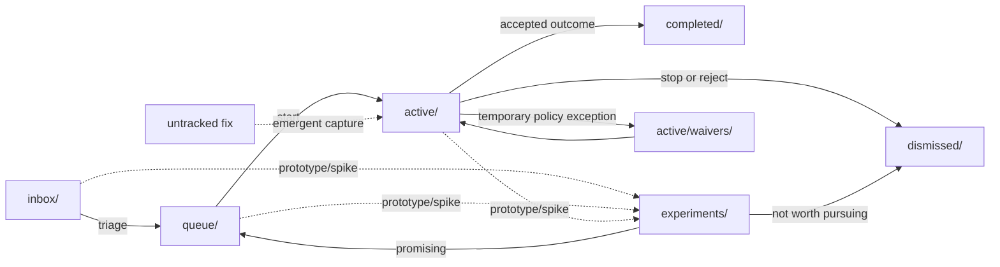

# Project Workflow (`wow/`)

This folder is your lightweight project board.

Use it to move work through clear states:

`inbox` -> `queue` -> `active` -> `completed` (or `dismissed`)

Related references:

- Operator manual: `doc/man/09-wow-workflow-board.md`
- Architecture rationale: `doc/arc/08-workflow-architecture.md`

## Operator quickstart

Daily single-item flow (manual):

```text
wow/task/inbox-capture
<one-line idea>
wow/task/queue-triage
wow/task/active-move
wow/queue/<item>.md
wow/task/active-start
wow/active/<item>.md
bash wow/check-workflow.sh
wow/task/completed-close
wow/active/<item>.md
```

Optional bundle-close path when related items should share one completed folder:

```text
wow/task/completed-close-bundle
wow/active/<item>.md mode=auto module=<module-name> essence=<summary-slug>
```

Parallel trigger (large initiatives only, from active parent):

```text
wow/task/active-promote
wow/active/<topic>-plan.md
wow/task/active-fanout
wow/active/<topic>-program-plan.md
wow/task/active-assign
wow/active/<topic>-program-plan.md
```

## Workflow diagram



## Folder meanings

- `inbox/`: ideas, issues, plans, and tasks you might do later
- `queue/`: prioritized items ready to start next
- `active/`: work currently in progress
  - `active/waivers/`: temporary policy waivers tied to active items
- `completed/`: finished work with final outcome documented
- `dismissed/`: ideas you decided not to do (with a short reason)
- `experiments/`: alternative approaches/prototypes

## Filename timestamp rule (required)

Workflow item markdown files in these folders must use this prefix format:

- `inbox/`, `queue/`, `active/`, `completed/`, `dismissed/`, `experiments/`

- `yyyymmdd-hhmm_filename`

Where `yyyymmdd-hhmm` is the file creation time for that work item.

Keep this prefix stable after creation to avoid noisy rename churn.

Root meta/support files directly under `wow/` (for example checklist and
checker helpers) do not require timestamp prefixes.

When you update a file in this folder tree:

1. Keep the existing filename prefix unchanged.
2. Update the `- Updated:` field in the document header.
3. Rename only if the topic slug or folder state changes.

Examples:

- `20260228-0940_inbox-item-plan.md`

## Recommended flow (best practice)

1. Capture in `inbox/`
   - Add new ideas quickly.
   - Keep one file per idea/issue/plan.

2. Prioritize -> move to `queue/`
   - Move files from `inbox/` to `queue/` once they are triaged and prioritized.
   - During triage, classify design need (see `agentic-workflow-prompts.md`
     templates 2-3). Answer two questions:
     1. Are there meaningful alternatives for how to solve this?
     2. Will other code or users depend on the shape of the output?
   - If either is yes: mark `Design: required` in the `## Triage Decision`.
   - If both are no: mark `Design: not needed`.
   - Use exactly one canonical token line: `Design: required` or
     `Design: not needed`.
   - Do not use legacy wording such as `Design required: Yes/No`.
   - This classification determines how the Execution Plan is structured when
     the item moves to `active/`.

3. Start work -> move to `active/`
   - Move the file from `queue/` to `active/` when you commit to doing it.
   - If helpful, prefix with sequence number (`0-`, `1-`, `2-`) to show execution order.
   - **Planned work** must pass through `queue/` first. Triage is where the
     design question gets answered; skipping it means starting work without
     knowing what kind of work it is.
   - **Emergent work** (a quick fix that grew beyond a single-session scope)
     may enter `active/` directly via retroactive capture (`active-capture`
     task). The capture document must include escalation rationale, the two
     triage design questions answered inline, and a progress checkpoint.
     This is not a shortcut for skipping triage — it is recognition that
     triage happened implicitly when you decided the work was worth
     continuing.
   - Add `## Documentation Impact` with exactly one token:
     `Docs: required`, `Docs: none`, or `Docs: deferred`.
   - If `Docs: required`, list initial docs targets and keep updates in the
     same workflow item.

4. Execute and review in `active/`
    - Yes: review notes can stay in `active/` while work is still open.
    - Keep review files tied to the same topic slug (example: `ana-...-review.md`).
    - For structured supporting outputs, run `wow/task/active-artifacts` on the
      active plan.
    - Artifact generation is contract-driven via optional `## Artifact Contract`
      in the plan; default contract is `Profile: general` and
      `Artifacts: evidence,result`.

5. Finish -> move to `completed/`
   - When implementation + review are accepted, move related files to `completed/`.
   - Add a short final section: what changed, what was verified, what remains.
   - In `## What was verified`, include exactly one docs outcome token:
     `Docs: updated`, `Docs: none`, or `Docs: deferred`.
   - `Docs: deferred` is allowed only with blocker reason + linked follow-up
     item path (default route: `inbox/`; direct `queue/` only for mandatory,
     scope-clear, priority-locked follow-up).
   - For architecture-sensitive `lib/` changes, run `./val/lib/confidence_gate.sh`
     with the appropriate `--risk` level before close.
   - If structural/public surfaces changed (new/renamed functions, signature
     changes, dependency changes, variable map changes), regenerate references
     with `./utl/ref/run_all_doc.sh` and capture the result.
   - Follow-up routing: default to new `inbox/` items.
   - Exception: create follow-ups directly in `queue/` only when mandatory,
     scope is clear, and priority is already locked.
   - For direct queue routing, add in `## What remains`:
     `Routing: queue (mandatory follow-up)` and a one-line rationale.

6. Reject -> move to `dismissed/`
   - If you decide not to continue, move the file to `dismissed/`.
   - Add one or two lines explaining why (obsolete, too risky, low value, duplicate, etc.).

## State entry/exit criteria

| State | Enter when | Exit when |
|---|---|---|
| `inbox/` | idea captured, not yet prioritized | triaged and priority decided |
| `queue/` | ready to execute, waiting for capacity | work starts (`active/`) or cancelled (`dismissed/`) |
| `active/` | owner is actively executing now | accepted outcome (`completed/`) or stopped (`dismissed/`) |
| `experiments/` | spike/prototype is needed before commitment | promote to `queue/` or close in `dismissed/` |
| `completed/` | implementation/review accepted with evidence | no further state transition; follow-up becomes a new inbox item by default, with direct queue allowed for mandatory priority-locked follow-ups |
| `dismissed/` | item explicitly not pursued | no further state transition; revisit as a new item |

## Artifact Contract (active items)

Use this optional section in an active plan when you want reusable,
deterministic artifact generation.

```md
## Artifact Contract

- Profile: general
- Artifacts: evidence,result
```

- `wow/task/active-artifacts` reads this section and creates/updates the
  requested artifacts in `wow/active/`.
- Supported artifact names: `evidence`, `result`, `decision-log`, `checklist`.
- If the section is missing, defaults are applied:
  - `Profile: general`
  - `Artifacts: evidence,result`
- Unsupported artifact names are skipped and reported.
- Artifact files in `wow/active/` are workflow docs and must satisfy normal
  checker constraints (required header fields and canonical triage token).

## Parallel orchestration for large initiatives

Use this mode for large refactors or multi-surface projects where one plan is
too broad for a single context window.

### When to use

- Work spans multiple independent modules or teams.
- Safe execution benefits from concurrent workstreams.
- Integration order and dependency gates matter.

### Manual trigger points (important)

- Parallel orchestration is manual-by-invocation, not automatic. The board does
  not auto-split based on task size.
- Start with normal flow: `inbox/` -> `queue/` -> `active/`.
- If the active parent is still a normal `-plan.md`, run
  `wow/task/active-promote` first to convert it to a
  `*-program-plan.md` parent and scaffold orchestration sections.
- Then use `wow/task/active-fanout` to create child workstream plans,
  `active-assign` to bind ownership/worktrees, `active-sync` to roll up state,
  and `active-converge` to close a wave.
- `wow/check-workflow.sh` validates structure and orchestration metadata;
  it never creates, splits, or moves work items.
- `active-split` is separate from orchestration fan-out: it decomposes one
  active item into new `inbox/` items that must re-enter triage.

### Core model

- **Program plan (parent):** one control-plane item, typically named
  `yyyymmdd-hhmm_<topic>-program-plan.md`.
- **Workstream plans (children):** multiple focused `-plan` items that each map
  to one worker context.
- **Execution pattern:** one coordinator context manages the program plan;
  worker contexts execute child plans in parallel.

### Parent requirements

Program plans should include these sections:

- `## Program Scope`
- `## Global Invariants`
- `## Workstreams`
- `## Integration Cadence`

`## Workstreams` is the source of truth for dependency order, wave assignment,
and current per-workstream status.

### Child requirements

Each child plan should include `## Orchestration Metadata` with these keys:

- `Program: <path to parent program plan>`
- `Workstream-ID: WS-<nn>`
- `Depends-On: none | WS-..,WS-..`
- `Touch-Set: <path prefixes or globs>`
- `Merge-Gate: minimal | module | integration`
- `Branch: <git branch name>`
- `Worktree: <absolute path | none>`

### Operating cadence (waves)

1. Coordinator fans out child plans and assigns owners/contexts.
2. Workers execute and checkpoint child plans.
3. Coordinator syncs checkpoints into the parent workstream table.
4. Coordinator converges wave outputs, runs integration checks, and opens the
   next wave.

Prefer this mode only when it clearly reduces risk or cycle time. For small
changes, keep using the standard single-plan flow.

## Important rule

If something is in `active/`, it is not done yet.

- Review notes in `active/` are normal while work is ongoing.
- Once the result is acceptable, move both the plan and review notes to `completed/`.

## Keep `completed/` organized

Use v2 immutable leaves and day/module containers:

- Standard close leaf (v2): `completed/yyyymmdd-hhmm_<module>_<task-slug>/<files>.md`
- Maintenance container (v2): `completed/yyyymmdd-<module>_<essence-slug>/`
- Nested leaf layout (v2):
  `completed/yyyymmdd-<module>_<essence-slug>/yyyymmdd-hhmm_<module>_<task-slug>/<files>.md`
- Legacy compatibility remains accepted for historical folders:
  - `completed/yyyymmdd-hhmm_<topic>/<files>.md`
  - `completed/yyyymmdd-hhmm-bundle-<module-slug>/<files>.md`
- Leaf folder timestamp (`yyyymmdd-hhmm`) is the close time and must be >= file
  creation timestamp prefixes in that leaf.
- Maintenance containers are unique per day+module key (`yyyymmdd-<module>`),
  include one markdown summary artifact, and keep leaf names immutable.
- Essence derivation for new containers is deterministic across maintenance and
  bundle-close flows: explicit `essence`/`summary` override, then summary
  title, then task-title fallback, then `daily-rollup` only when semantic
  sources are empty.
- New container writes must not use `_bundle` as essence; existing `_bundle`
  folders remain accepted as legacy compatibility paths.
- Bundle registry file: `completed/.bundle-registry.tsv` with one row per
  day+module key:
  `day-module-key<TAB>folder-name<TAB>created-at<TAB>source-item-path`.
  On conflict (same key, different folder), report and resolve manually.

Registry backfill example (maintenance adds missing row, no folder rename):

```text
ana-20260307	20260307-ana_daily-rollup	20260307-2105	wow/active/20260307-2048_ops-hotspot-wave-2-release-followup.md
```

Example:

```
completed/20260301-ana_daily-rollup/
    20260301-1500_ana_module-expansion/
        20260227-0310_plan.md          # created early
        20260227-0310_result.md        # created early
    20260301-1605_summary.md
```

`ls completed/` stays scan-friendly by close day/module, while leaf folders preserve exact close timestamps.

## Minimal document template

Use this header at the top of each work file:

```md
# <Title>

- Status: inbox | queue | active | experiment | completed | dismissed
- Owner: <name>
- Started: YYYY-MM-DD
- Updated: YYYY-MM-DD
- Links: related files/PRs/tests
```

Optional active artifact contract block:

```md
## Artifact Contract

- Profile: general
- Artifacts: evidence,result
```

## Validation helpers

- Checklist (quick pre-commit review):
  - File names follow folder naming rules (`inbox`, `dismissed`).
  - Workflow item files use `yyyymmdd-hhmm_filename` prefix.
  - Filename timestamp prefix is creation time and stays stable after creation.
  - On content edits, update the `Updated` header field instead of renaming.
  - Root meta/support files under `wow/` do not need timestamp prefixes.
  - Every workflow doc has header fields: `Status`, `Owner`, `Started`, `Updated`, `Links`.
  - Dismissed docs include `## Dismissal Reason`.
  - `active/` contains only in-progress items.
  - `active/waivers/*_waiver-register.md` entries include owner, expiry date, and removal criteria.
  - New completed leaves use `completed/yyyymmdd-hhmm_<module>_<task-slug>/`.
  - Day/module containers use `completed/yyyymmdd-<module>_<essence-slug>/`
    and may contain immutable leaf folders one level deeper.
  - Legacy completed folders remain accepted for historical records.
- Checker script: `bash wow/check-workflow.sh`

## Checker behavior

`bash wow/check-workflow.sh` currently enforces:

- Timestamp prefix format for workflow docs: `yyyymmdd-hhmm_filename`
- Required header fields in workflow-header docs across workflow folders: `Status`, `Owner`, `Started`, `Updated`, `Links`
- Status must match destination folder (`inbox`, `queue`, `active`, `experiment`, `completed`, `dismissed`)
- Queue/active docs contain exactly one `## Triage Decision` section
- Queue/active docs include exactly one canonical design token in triage:
  `Design: required` or `Design: not needed`
- Queue/active docs do not use legacy triage token form: `Design required: Yes/No`
- Active plan docs include exactly one `## Documentation Impact` section with
  exactly one docs token: `Docs: required`, `Docs: none`, or `Docs: deferred`
- Completed plan docs that include `## Documentation Impact` must include
  exactly one docs outcome token in `## What was verified`:
  `Docs: updated`, `Docs: none`, or `Docs: deferred`
- Inbox naming pattern (`-plan`, `-issue`, `-review`, `-followup`)
- Dismissed naming pattern (`-plan`) and required `## Dismissal Reason`
- Completed structure supports:
  - `completed/<leaf-folder>/<file>.md`
  - `completed/<container-folder>/<leaf-folder>/<file>.md`
- Valid leaf folders:
  - v2: `yyyymmdd-hhmm_<module>_<task-slug>`
  - legacy: `yyyymmdd-hhmm_<topic>` and `yyyymmdd-hhmm-bundle-<module-slug>`
- Valid container folders (v2): `yyyymmdd-<module>_<essence-slug>`
- Completed chronology: leaf folder completion timestamp is not older than file
  creation timestamp prefixes inside that leaf
- Container alignment: nested leaf day must match container day; if nested leaf
  is v2, its module must match container module
- Container uniqueness: one v2 container per day+module key and one legacy
  bundle folder per module slug
- Completed topic/container folders are non-empty; v2 containers must include
  at least one markdown summary artifact and at least one leaf folder
- Legacy completed placeholder paths are not allowed (`completed/<topic>/`)

It does not currently enforce:

- Stale-item age checks for `active/`
- Verification depth/quality in completed outcomes
- Queue prioritization quality

Common fixes when it fails:

- `FAIL timestamp prefix`: rename file to `yyyymmdd-hhmm_filename`
- `FAIL header`: add missing header fields near the top of the document
- `FAIL completed structure`: move file to `completed/<topic-folder>/` using
  v2 leaf/container layout or a supported legacy pattern
- `FAIL completed folder timestamp`: rename folder to a valid topic-folder name
  (`yyyymmdd-hhmm_<module>_<task-slug>`, legacy `yyyymmdd-hhmm_<topic>`,
  legacy `yyyymmdd-hhmm-bundle-<module-slug>`, or `yyyymmdd-<module>_<essence>`)
- `FAIL completed topic folder`: rename topic folder to one valid pattern:
  v2 leaf/container format or supported legacy format
- `FAIL completed topic folder empty`: remove empty folder or move related completed docs into it
- `FAIL completed folder chronology`: rename completed folder timestamp to a value that is not older than any completed file prefix
- `FAIL completed bundle duplicate`: move files into the existing bundle folder
  for that module slug and keep one stable `*-bundle-<module-slug>` folder
- `FAIL completed container duplicate`: keep one container per day+module key and move leaves into it
- `FAIL completed container day/module mismatch`: move nested leaves so day/module align with container
- `FAIL completed container child`: keep only valid leaf folders under v2 containers
- `FAIL legacy completed placeholder`: replace `completed/<topic>/` with
  `completed/yyyymmdd-hhmm_<module>_<task-slug>/` (or an accepted legacy path)
- `FAIL dismissal reason`: add `## Dismissal Reason` section in dismissed item
- `FAIL documentation impact missing/token`: add one `## Documentation Impact`
  section with exactly one docs token (`required|none|deferred`)
- `FAIL docs outcome token`: add exactly one docs outcome token
  (`updated|none|deferred`) in `## What was verified`
- `FAIL triage decision missing`/`duplicate`: add one `## Triage Decision` section
- `FAIL triage design token`/`legacy token`: use exactly one canonical token,
  `Design: required` or `Design: not needed`

Recommended habit: run the checker before and after any workflow move.

---

Keep this README focused on workflow rules and checker behavior.
Track actionable improvements as work items under `wow/inbox/`.
